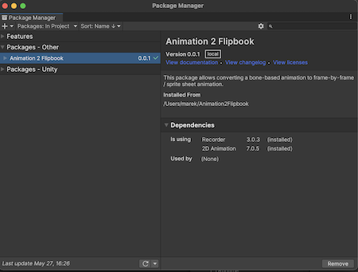

## Animation 2 Flipbook
This package allows converting rigged animations to sequence of frames (flipbook).

## Getting Started
Make sure you have installed the package by adding it to your project through the [Package Manager](https://docs.unity3d.com/Manual/upm-ui.html). If you have problems check the **Installation** section of this page.

Here is a [short video](https://youtu.be/puZ3UtfOREI) that shows an example of how to use this tool.

### Converting Animations to Sequence of Images

Select **Tools** -> **Animation 2 Flipbook** from the top menu.

This will open a new window:

1. To start converting animations to sequences of frames, select a prefab of an object or a character that you want to use. To do that drag & drop prefab from your Assets folder onto the ''**Object to Animate**'' field.

2. Next, add animation clips you wish to record to the ''**Animation Clips**'' list.

3. Click on the **Generate** button to start exporting animations.

During the exporting process, Unity will open a new scene and ask you to save your changes if you have any in your current scene. Object that you chose to animate will be recorded with each animation from the 'Animation Clips' list. If you wish to use your own scene for recording, make sure to select the 'Use Custom Scene' under the 'Advanced Options'.

**Important Note:** Animations will be played on the **root** game object of your prefab.

After Animation 2 Flipbook finished its work, exported images can be found the location specified in the 'Save Path' in your Project Folder e.g., 'YourProjectName / OutputSprites'.

Size of output images can be adjusted by setting the 'Output Width' and 'Output Height' field. The size of the camera used for recording is calculated based on bounds of all renderers that exist in the prefab.

To make sure that non of the parts are outside of the final image during animation when character is deformed, set the 'Encompassing Frame' to values greater than 1 - this will scale up the camera size relatively to the character bounds e.g., value 1.3 will scale it up by 30%.

## Known Issues
- Recording in 'perspective' mode (with Orthographic option disabled) doesn't work well with large Field of View values.

## Work in Progress

- Save output images as a single Spritesheet.
- Improve 3D recording.

## Installation

Animation 2 Flipbook can be installed as a package. This [Unity Documentation](https://docs.unity3d.com/Manual/upm-ui-giturl.html) explains how to install git packages.
1. Select **Window** -> **Package Manager** to open **Package Manger**.
2. Click on the '**+**' button and select '**Add package from git URL..**' from the dropdown.

3. Paste the git url into the text field 'https://github.com/MarekMarchlewicz/Animation2Flipbook.git' and press '**Add**' button.

After successful installation Animation 2 Flipbook package should appear in the Package Manger:

